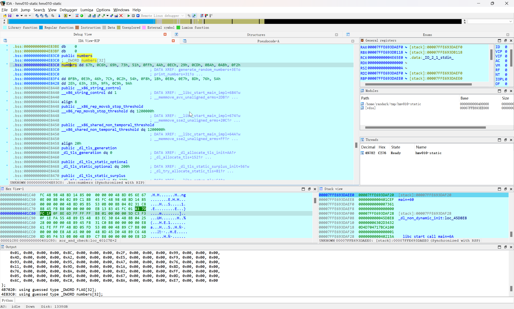
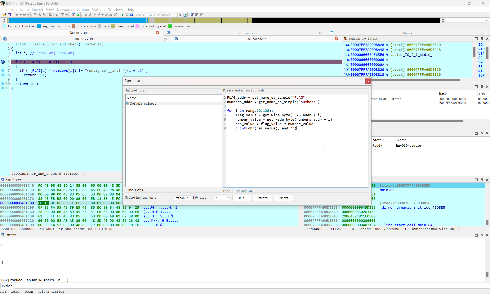

# Reversing - 076

:::note

created by || kerszi

⏲️ Release Date // 2024-07-05

💀 Solvers // 1

🧩 Type // rev

:::

将二进制文件拖进 IDA 进行反编译分析，首先先看入口函数

```c
int __fastcall main(int argc, const char **argv, const char **envp)
{
  int v3; // edx
  int v4; // ecx
  int v5; // r8d
  int v6; // r9d
  int v7; // edx
  int v8; // ecx
  int v9; // r8d
  int v10; // r9d
  char v12[40]; // [rsp+0h] [rbp-30h] BYREF
  unsigned __int64 v13; // [rsp+28h] [rbp-8h]

  v13 = __readfsqword(0x28u);
  generate_random_numbers(argc, argv, envp);
  printf((unsigned int)"Enter the flag :", (_DWORD)argv, v3, v4, v5, v6, v12[0]);
  _isoc99_scanf((unsigned int)"%32s", (unsigned int)v12, v7, v8, v9, v10, v12[0]);
  if ((unsigned int)xor_and_check(v12) )
    puts(&unk_4B70CF);
  else
    puts(&unk_4B70E0);
  return 0;
}
```

在其中定位到关键部分

```c
printf((unsigned int)"Enter the flag :", (_DWORD)argv, v3, v4, v5, v6, v12[0]);
_isoc99_scanf((unsigned int)"%32s", (unsigned int)v12, v7, v8, v9, v10, v12[0]);
if ((unsigned int)xor_and_check(v12) )
  puts(&unk_4B70CF);
else
  puts(&unk_4B70E0);
```

可以看到，程序在使用 `_isoc99_scanf` 函数读入一个字符串并储存为 `v12` 变量之后，将字符串传入了 `xor_and_check` 函数，继续跟进，查看 `xor_and_check` 函数的逻辑

```c
__int64 __fastcall xor_and_check(__int64 a1)
{
  int i; // [rsp+14h] [rbp-4h]

  for (i = 0; i <= 31; ++i)
  {
    if ((FLAG[i] ^ numbers[i]) != *(unsigned __int8 *)(i + a1) )
      return 0LL;
  }
  return 1LL;
}
```

结合上下文逻辑，用户输入的字符串储存为 `a1` 变量，然后再逐位与 `FLAG[i] ^ numbers[i]` 的运算结果进行比对，如果结果不一致的话就返回 `0LL` 状态码，也就是答案错误。那么问题就很明显了，需要对 `FLAG[i] ^ numbers[i]` 的结果进行提取

对 FLAG 变量进行查看

```c
unsigned char FLAG[128] = {
    0x2F, 0x00, 0x00, 0x00, 0x8B, 0x00, 0x00, 0x00, 0x3F, 0x00, 0x00, 0x00, 0x08, 0x00, 0x00, 0x00,
    0x01, 0x00, 0x00, 0x00, 0x8C, 0x00, 0x00, 0x00, 0x2F, 0x00, 0x00, 0x00, 0x99, 0x00, 0x00, 0x00,
    0x4D, 0x00, 0x00, 0x00, 0xA2, 0x00, 0x00, 0x00, 0xE5, 0x00, 0x00, 0x00, 0xF9, 0x00, 0x00, 0x00,
    0x93, 0x00, 0x00, 0x00, 0x95, 0x00, 0x00, 0x00, 0xA7, 0x00, 0x00, 0x00, 0x76, 0x00, 0x00, 0x00,
    0x11, 0x00, 0x00, 0x00, 0x9D, 0x00, 0x00, 0x00, 0x1A, 0x00, 0x00, 0x00, 0x8D, 0x00, 0x00, 0x00,
    0x76, 0x00, 0x00, 0x00, 0x8A, 0x00, 0x00, 0x00, 0x82, 0x00, 0x00, 0x00, 0xFF, 0x00, 0x00, 0x00,
    0x05, 0x00, 0x00, 0x00, 0x05, 0x00, 0x00, 0x00, 0x67, 0x00, 0x00, 0x00, 0x0D, 0x00, 0x00, 0x00,
    0x6C, 0x00, 0x00, 0x00, 0xC0, 0x00, 0x00, 0x00, 0x8A, 0x00, 0x00, 0x00, 0xE7, 0x00, 0x00, 0x00
};
```

但是对于 `numbers[]` 数组，对其进行跟踪，得到

```c
.bss:00000000004E83C0 numbers         dd 20h dup(?)           ; DATA XREF: generate_random_numbers+3E↑o
.bss:00000000004E83C0                                         ; print_numbers+31↑o ...
```

跟踪 `generate_random_numbers` 函数

```c
_DWORD *generate_random_numbers()
{
  _DWORD *result; // rax
  int v1; // ecx
  int i; // [rsp+Ch] [rbp-4h]

  result = (_DWORD *)srandom(0LL);
  for (i = 0; i <= 31; ++i)
  {
    v1 = (int)rand() % 256;
    result = numbers;
    numbers[i] = v1;
  }
  return result;
}
```

程序使用 `srandom` 函数进行了随机数种子的初始化，然后逐位使用 `rand` 函数对 `numbers[]` 数组进行了初始化。

由于反编译的 `srandom` 函数与 C 标准中的 `srand` 函数函数表现上不一致，所以采用动态调试的方式进行数据提取



获取到`numbers[]`数组的数据之后，就可以编写脚本进行解码

```c
#include <stdio.h>
#include <stdlib.h>
#include <time.h>

unsigned char FLAG[128] = {
    0x2F, 0x00, 0x00, 0x00, 0x8B, 0x00, 0x00, 0x00, 0x3F, 0x00, 0x00, 0x00, 0x08, 0x00, 0x00, 0x00,
    0x01, 0x00, 0x00, 0x00, 0x8C, 0x00, 0x00, 0x00, 0x2F, 0x00, 0x00, 0x00, 0x99, 0x00, 0x00, 0x00,
    0x4D, 0x00, 0x00, 0x00, 0xA2, 0x00, 0x00, 0x00, 0xE5, 0x00, 0x00, 0x00, 0xF9, 0x00, 0x00, 0x00,
    0x93, 0x00, 0x00, 0x00, 0x95, 0x00, 0x00, 0x00, 0xA7, 0x00, 0x00, 0x00, 0x76, 0x00, 0x00, 0x00,
    0x11, 0x00, 0x00, 0x00, 0x9D, 0x00, 0x00, 0x00, 0x1A, 0x00, 0x00, 0x00, 0x8D, 0x00, 0x00, 0x00,
    0x76, 0x00, 0x00, 0x00, 0x8A, 0x00, 0x00, 0x00, 0x82, 0x00, 0x00, 0x00, 0xFF, 0x00, 0x00, 0x00,
    0x05, 0x00, 0x00, 0x00, 0x05, 0x00, 0x00, 0x00, 0x67, 0x00, 0x00, 0x00, 0x0D, 0x00, 0x00, 0x00,
    0x6C, 0x00, 0x00, 0x00, 0xC0, 0x00, 0x00, 0x00, 0x8A, 0x00, 0x00, 0x00, 0xE7, 0x00, 0x00, 0x00};

unsigned char numbers[128] = {
    0x67, 0x00, 0x00, 0x00, 0xC6, 0x00, 0x00, 0x00, 0x69, 0x00, 0x00, 0x00, 0x73, 0x00, 0x00, 0x00, 
    0x51, 0x00, 0x00, 0x00, 0xFF, 0x00, 0x00, 0x00, 0x4A, 0x00, 0x00, 0x00, 0xEC, 0x00, 0x00, 0x00, 
    0x29, 0x00, 0x00, 0x00, 0xCD, 0x00, 0x00, 0x00, 0xBA, 0x00, 0x00, 0x00, 0xAB, 0x00, 0x00, 0x00, 
    0xF2, 0x00, 0x00, 0x00, 0xFB, 0x00, 0x00, 0x00, 0xE3, 0x00, 0x00, 0x00, 0x46, 0x00, 0x00, 0x00, 
    0x7C, 0x00, 0x00, 0x00, 0xC2, 0x00, 0x00, 0x00, 0x54, 0x00, 0x00, 0x00, 0xF8, 0x00, 0x00, 0x00, 
    0x1B, 0x00, 0x00, 0x00, 0xE8, 0x00, 0x00, 0x00, 0xE7, 0x00, 0x00, 0x00, 0x8D, 0x00, 0x00, 0x00, 
    0x76, 0x00, 0x00, 0x00, 0x5A, 0x00, 0x00, 0x00, 0x2E, 0x00, 0x00, 0x00, 0x63, 0x00, 0x00, 0x00, 
    0x33, 0x00, 0x00, 0x00, 0x9F, 0x00, 0x00, 0x00, 0xC9, 0x00, 0x00, 0x00, 0x9A, 0x00, 0x00, 0x00
};

int main()
{
    for (int i = 0; i < 128; ++i)
    {
        printf("%c", numbers[i] ^ FLAG[i]);
    }
    return 0;
}
// HMV{Pseudo_RanD0m_Numbers_In__C}
```

或者，可以在调试过程中，使用`Shift + F2`打开脚本窗口，使用脚本进行计算

```python
FLAG_addr = get_name_ea_simple("FLAG")
numbers_addr = get_name_ea_simple("numbers")

for i in range(0,128):
    flag_value = get_wide_byte(FLAG_addr + i)
    number_value = get_wide_byte(numbers_addr + i)
    res_value = flag_value ^ number_value
    print(chr(res_value), end="")
```


