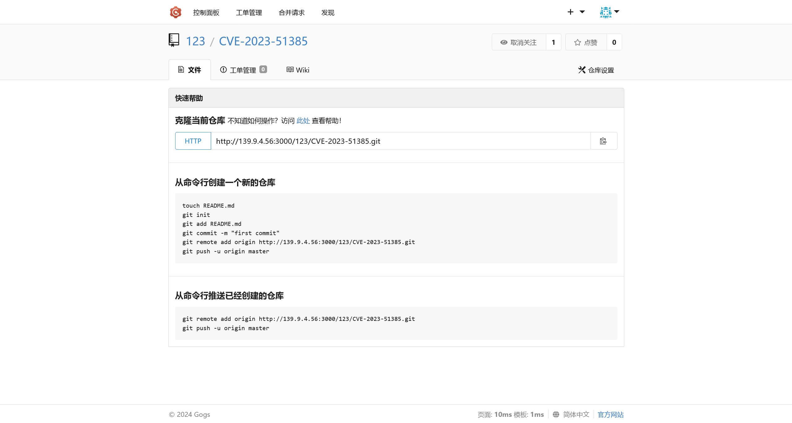

# CVE-2023-51385

:::info

Tags

- OpenSSH 9.6 命令注入

官方数据库记录

> 在 9.6 之前的 OpenSSH 中的 ssh 中，如果用户名或主机名具有 shell 元字符，并且在某些情况下该名称被扩展令牌引用，则可能会发生操作系统命令注入。 例如，不受信任的 Git 存储库可能有一个用户名或主机名中包含 shell 元字符的子模块。

:::

参考

- [SSH ProxyCommand == unexpected code execution (CVE-2023-51385) | Vin01’s Blog](https://vin01.github.io/piptagole/ssh/security/openssh/libssh/remote-code-execution/2023/12/20/openssh-proxycommand-libssh-rce.html)

根据环境提供的 `~/.ssh/config` 信息来看，存在有注入漏洞

```plaintext
host *.ichunqiu.com
    ProxyCommand /usr/bin/nc -X connect -x 192.0.2.0:8080 %h %p
```

使用 gogs 启动一个 git 服务器



然后在新的仓库内写入 `.gitmodules`

TODO 环境未能成功触发执行命令，怀疑存在问题
