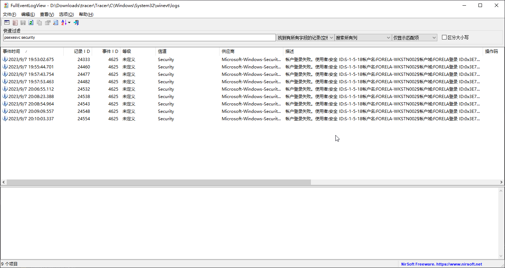

# Tracer

:::info Sherlock Scenario

A junior SOC analyst on duty has reported multiple alerts indicating the presence of PsExec on a workstation. They verified the alerts and escalated the alerts to tier II. As an Incident responder you triaged the endpoint for artefacts of interest. Now please answer the questions regarding this security event so you can report it to your incident manager.

一名值班的初级 SOC 分析师报告了多个警报，表明工作站上存在 PsExec。他们验证了这些警报并将其升级给二级支持团队。作为事件响应人员，您对端点进行了初步调查，以查找感兴趣的证据。现在，请回答以下关于这一安全事件的问题，以便向您的事件经理报告。

:::

## 题目数据

[tracer.zip](./tracer.zip)

:::note

本文章使用了 [FullEventLogView](https://www.nirsoft.net/utils/full_event_log_view.html) 工具辅助进行日志分析

:::

## Task 1

> SOC 团队怀疑有一个对手潜伏在他们的环境中，并且正在使用 PsExec 进行横向移动。一名初级 SOC 分析师特别报告了在一台工作站上使用了 PsExec。攻击者在系统上执行了多少次 PsExec？

在 `Security.evtx` 中，日志第一条就是我们要追踪的 PsExec 对象

```xml
<Event xmlns="http://schemas.microsoft.com/win/2004/08/events/event">
  <System>
    <Provider Name="Microsoft-Windows-Security-Auditing" Guid="{54849625-5478-4994-a5ba-3e3b0328c30d}" />
    <EventID>4625</EventID>
    <Version>0</Version>
    <Level>0</Level>
    <Task>12544</Task>
    <Opcode>0</Opcode>
    <Keywords>0x8010000000000000</Keywords>
    <TimeCreated SystemTime="2023-09-07T12:10:03.3378931Z" />
    <EventRecordID>24554</EventRecordID>
    <Correlation ActivityID="{3e97425f-e181-0001-8a42-973e81e1d901}" />
    <Execution ProcessID="808" ThreadID="880" />
    <Channel>Security</Channel>
    <Computer>Forela-Wkstn002.forela.local</Computer>
    <Security />
  </System>
  <EventData>
    <Data Name="SubjectUserSid">S-1-5-18</Data>
    <Data Name="SubjectUserName">FORELA-WKSTN002$</Data>
    <Data Name="SubjectDomainName">FORELA</Data>
    <Data Name="SubjectLogonId">0x3e7</Data>
    <Data Name="TargetUserSid">S-1-0-0</Data>
    <Data Name="TargetUserName">administrator</Data>
    <Data Name="TargetDomainName">FORELA-WKSTN002</Data>
    <Data Name="Status">0xc000006d</Data>
    <Data Name="FailureReason">%%2313</Data>
    <Data Name="SubStatus">0xc000006a</Data>
    <Data Name="LogonType">2</Data>
    <Data Name="LogonProcessName">Advapi  </Data>
    <Data Name="AuthenticationPackageName">Negotiate</Data>
    <Data Name="WorkstationName">FORELA-WKSTN002</Data>
    <Data Name="TransmittedServices">-</Data>
    <Data Name="LmPackageName">-</Data>
    <Data Name="KeyLength">0</Data>
    <Data Name="ProcessId">0x262c</Data>
    <Data Name="ProcessName">C:\Windows\PSEXESVC.exe</Data>
    <Data Name="IpAddress">-</Data>
    <Data Name="IpPort">-</Data>
  </EventData>
</Event>
```

可以得到 PsExec 的具体服务的名称：`PSEXESVC`

使用 `FullEventLogView` 使用关键字 `psexesvc security`，共筛选出来 9 条记录



```plaintext title="Answer"
9
```

## Task 2

> PsExec 工具释放的服务二进制文件的名称是什么，使得攻击者能够执行远程命令？

上一题中就有

```plaintext title="Answer"
PSEXESVC.exe
```

## Task 3

> 现在我们确认了 PsExec 运行了多次，我们特别关注第 5 次运行的 PsExec 实例。PsExec 服务二进制文件运行的时间戳是什么？

:::warning

问题需要认真审题，需要注意的是，这里提问的是 `psexec` 的执行时间，而系统日志中所记录的是 `psexec` 执行用户登录的事件

:::

如果需要对程序的执行数据进行分析，结合题目中所给的附件，就只能对 `prefetch` 文件进行分析

接下来要对 `prefetch` 文件进行分析，因为 `prefetch` 文件中储存了程序在运行时的缓存数据，可能其中含有有价值的信息

为了对 `prefetch` 文件进行分析，将使用 [PECmd](https://github.com/EricZimmerman/PECmd) 这个工具

针对 `psexec`，定位到 `PSEXESVC.EXE-AD70946C.pf` 文件，进行分析

```shell
PS D:\_Tool\_ForensicAnalyzer\PECmd> .\PECmd.exe -f D:\Downloads\tracer\Tracer\C\Windows\prefetch\PSEXESVC.EXE-AD70946C.pf --csv D:\Downloads\res
```

分析报告将会保存在 `D:\Downloads\res` 目录下，对 `20240102035233_PECmd_Output_Timeline.csv` 这个报告文件进行查看

|    RunTime     |                     ExecutableName                      |
| :------------: | :-----------------------------------------------------: |
| 2023/9/7 12:10 | `\VOLUME{01d951602330db46-52233816}\WINDOWS\PSEXESVC.EXE` |
| 2023/9/7 12:09 | `\VOLUME{01d951602330db46-52233816}\WINDOWS\PSEXESVC.EXE` |
| 2023/9/7 12:08 | `\VOLUME{01d951602330db46-52233816}\WINDOWS\PSEXESVC.EXE` |
| 2023/9/7 12:08 | `\VOLUME{01d951602330db46-52233816}\WINDOWS\PSEXESVC.EXE` |
| 2023/9/7 12:06 | `\VOLUME{01d951602330db46-52233816}\WINDOWS\PSEXESVC.EXE` |
| 2023/9/7 11:57 | `\VOLUME{01d951602330db46-52233816}\WINDOWS\PSEXESVC.EXE` |
| 2023/9/7 11:57 | `\VOLUME{01d951602330db46-52233816}\WINDOWS\PSEXESVC.EXE` |
| 2023/9/7 11:55 | `\VOLUME{01d951602330db46-52233816}\WINDOWS\PSEXESVC.EXE` |

即可定位时间

```plaintext title="Answer"
07/09/2023 12:06:54
```

## Task 4

> 您能确认攻击者进行横向移动的工作站的主机名吗？

在 `PECmd` 工具的命令行输出结果中，研判 `Files referenced` 部分的记录

```plaintext
00: \VOLUME{01d951602330db46-52233816}\WINDOWS\SYSTEM32\NTDLL.DLL
01: \VOLUME{01d951602330db46-52233816}\WINDOWS\PSEXESVC.EXE (Executable: True)
02: \VOLUME{01d951602330db46-52233816}\WINDOWS\SYSTEM32\KERNEL32.DLL
03: \VOLUME{01d951602330db46-52233816}\WINDOWS\SYSTEM32\KERNELBASE.DLL
04: \VOLUME{01d951602330db46-52233816}\WINDOWS\SYSTEM32\LOCALE.NLS
05: \VOLUME{01d951602330db46-52233816}\WINDOWS\SYSTEM32\USER32.DLL
06: \VOLUME{01d951602330db46-52233816}\WINDOWS\SYSTEM32\USERENV.DLL
07: \VOLUME{01d951602330db46-52233816}\WINDOWS\SYSTEM32\WIN32U.DLL
08: \VOLUME{01d951602330db46-52233816}\WINDOWS\SYSTEM32\UCRTBASE.DLL
09: \VOLUME{01d951602330db46-52233816}\WINDOWS\SYSTEM32\GDI32.DLL
10: \VOLUME{01d951602330db46-52233816}\WINDOWS\SYSTEM32\RPCRT4.DLL
11: \VOLUME{01d951602330db46-52233816}\WINDOWS\SYSTEM32\GDI32FULL.DLL
12: \VOLUME{01d951602330db46-52233816}\WINDOWS\SYSTEM32\MSVCP_WIN.DLL
13: \VOLUME{01d951602330db46-52233816}\WINDOWS\SYSTEM32\ADVAPI32.DLL
14: \VOLUME{01d951602330db46-52233816}\WINDOWS\SYSTEM32\MSVCRT.DLL
15: \VOLUME{01d951602330db46-52233816}\WINDOWS\SYSTEM32\SECHOST.DLL
16: \VOLUME{01d951602330db46-52233816}\WINDOWS\SYSTEM32\SHELL32.DLL
17: \VOLUME{01d951602330db46-52233816}\WINDOWS\SYSTEM32\WTSAPI32.DLL
18: \VOLUME{01d951602330db46-52233816}\WINDOWS\SYSTEM32\KERNEL.APPCORE.DLL
19: \VOLUME{01d951602330db46-52233816}\WINDOWS\SYSTEM32\NTMARTA.DLL
20: \VOLUME{01d951602330db46-52233816}\WINDOWS\PSEXEC-FORELA-WKSTN001-CAD5E7EF.KEY
21: \VOLUME{01d951602330db46-52233816}\WINDOWS\SYSTEM32\CRYPTSP.DLL
22: \VOLUME{01d951602330db46-52233816}\WINDOWS\SYSTEM32\RSAENH.DLL
23: \VOLUME{01d951602330db46-52233816}\WINDOWS\SYSTEM32\BCRYPT.DLL
24: \VOLUME{01d951602330db46-52233816}\WINDOWS\SYSTEM32\SSPICLI.DLL
25: \VOLUME{01d951602330db46-52233816}\WINDOWS\SYSTEM32\PROFAPI.DLL
26: \VOLUME{01d951602330db46-52233816}\WINDOWS\SYSTEM32\BCRYPTPRIMITIVES.DLL
27: \VOLUME{01d951602330db46-52233816}\PROGRAMDATA\MICROSOFT\CRYPTO\RSA\S-1-5-18\F05260A40AE771219C4528E4628312CD_B02EC91E-ADE1-4F67-9328-AE89B0EBD197
28: \VOLUME{01d951602330db46-52233816}\WINDOWS\SYSTEM32\CRYPTBASE.DLL
29: \VOLUME{01d951602330db46-52233816}\WINDOWS\SYSTEM32\NETAPI32.DLL
30: \VOLUME{01d951602330db46-52233816}\WINDOWS\SYSTEM32\LOGONCLI.DLL
31: \VOLUME{01d951602330db46-52233816}\WINDOWS\SYSTEM32\NETUTILS.DLL
32: \VOLUME{01d951602330db46-52233816}\WINDOWS\SYSTEM32\WINSTA.DLL
33: \VOLUME{01d951602330db46-52233816}\WINDOWS\PSEXEC-FORELA-WKSTN001-89A517EE.KEY
34: \VOLUME{01d951602330db46-52233816}\WINDOWS\PSEXEC-FORELA-WKSTN001-415385DF.KEY
35: \VOLUME{01d951602330db46-52233816}\WINDOWS\PSEXEC-FORELA-WKSTN001-C3E84A44.KEY
36: \VOLUME{01d951602330db46-52233816}\WINDOWS\PSEXEC-FORELA-WKSTN001-95F03CFE.KEY
37: \VOLUME{01d951602330db46-52233816}\$MFT
38: \VOLUME{01d951602330db46-52233816}\WINDOWS\PSEXEC-FORELA-WKSTN001-663BCB85.KEY
39: \VOLUME{01d951602330db46-52233816}\WINDOWS\PSEXEC-FORELA-WKSTN001-7AA5D6C6.KEY
40: \VOLUME{01d951602330db46-52233816}\WINDOWS\PSEXEC-FORELA-WKSTN001-EDCC783C.KEY
```

即可从 key 文件的文件名中，得到主机名

```plaintext title="Answer"
FORELA-WKSTN001
```

## Task 5

> Psexec 的倒数第 5 个实例释放的密钥文件的全名是什么？

对上一题中 `Files referenced` 部分的记录进行筛选，保留下 key 文件的记录

```plaintext
20: \VOLUME{01d951602330db46-52233816}\WINDOWS\PSEXEC-FORELA-WKSTN001-CAD5E7EF.KEY
33: \VOLUME{01d951602330db46-52233816}\WINDOWS\PSEXEC-FORELA-WKSTN001-89A517EE.KEY
34: \VOLUME{01d951602330db46-52233816}\WINDOWS\PSEXEC-FORELA-WKSTN001-415385DF.KEY
35: \VOLUME{01d951602330db46-52233816}\WINDOWS\PSEXEC-FORELA-WKSTN001-C3E84A44.KEY
36: \VOLUME{01d951602330db46-52233816}\WINDOWS\PSEXEC-FORELA-WKSTN001-95F03CFE.KEY
38: \VOLUME{01d951602330db46-52233816}\WINDOWS\PSEXEC-FORELA-WKSTN001-663BCB85.KEY
39: \VOLUME{01d951602330db46-52233816}\WINDOWS\PSEXEC-FORELA-WKSTN001-7AA5D6C6.KEY
40: \VOLUME{01d951602330db46-52233816}\WINDOWS\PSEXEC-FORELA-WKSTN001-EDCC783C.KEY
```

按照顺序定位第五个即可

```plaintext title="Answer"
PSEXEC-FORELA-WKSTN001-95F03CFE.key
```

## Task 6

> 您能确认该密钥文件在磁盘上创建的时间戳吗？

为了确定文件的时间戳，需要对 Windows 磁盘默认的 NTFS 储存结构协议的 `$Extend` 相关记录进行解析

这里使用到 [MFTECmd](https://github.com/EricZimmerman/MFTECmd) 这款工具

```shell
PS D:\_Tool\_ForensicAnalyzer\MFTECmd> .\MFTECmd.exe -f 'D:\Downloads\tracer\Tracer\C\$Extend\$J' --json 'D:\Downloads\tracer\Tracer\C\$Extend'
......
Usn entries found in D:\Downloads\tracer\Tracer\C\$Extend\$J: 145,944
        CSV output will be saved to D:\Downloads\tracer\Tracer\C\$Extend\20240102044257_MFTECmd_$J_Output.csv
```

对提取得到的数据进行筛选，可以得到三条记录

| Name                                | Extension | EntryNumber | SequenceNumber | ParentEntryNumber | ParentSequenceNumber | ParentPath | UpdateSequenceNumber | UpdateTimestamp | UpdateReasons                       | FileAttributes | OffsetToData | SourceFile                              |
| :---------------------------------- | :-------- | :---------- | :------------- | :---------------- | :------------------- | :--------- | :------------------- | :-------------- | :---------------------------------- | :------------- | :----------- | :-------------------------------------- |
| PSEXEC-FORELA-WKSTN001-95F03CFE.key | .key      | 219314      | 12             | 102274            | 1                    |            | 3247682232           | 06:55.1         | FileCreate                          | Archive        | 25375416     | D:\Downloads\tracer\Tracer\C\$Extend\$J |
| PSEXEC-FORELA-WKSTN001-95F03CFE.key | .key      | 219314      | 12             | 102274            | 1                    |            | 3247682368           | 06:55.1         | DataExtend|FileCreate               | Archive        | 25375552     | D:\Downloads\tracer\Tracer\C\$Extend\$J |
| PSEXEC-FORELA-WKSTN001-95F03CFE.key | .key      | 219314      | 12             | 102274            | 1                    |            | 3247682504           | 06:55.1         | DataExtend|FileCreate|RenameOldName | Archive        | 25375688     | D:\Downloads\tracer\Tracer\C\$Extend\$J |

```plaintext title="Answer"
07/09/2023 12:06:55
```

## Task 7

> 第 5 个 PsExec 实例的以 "stderr" 关键字结尾的命名管道的全名是什么？

对 `Microsoft-Windows-Sysmon%4Operational.evtx` 这个日志文件进行分析，针对上文得到的时间戳 `07/09/2023 12:06:54` 进行筛选，即可得到以下数据

```xml
<Event xmlns="http://schemas.microsoft.com/win/2004/08/events/event">
  <System>
    <Provider Name="Microsoft-Windows-Sysmon" Guid="{5770385f-c22a-43e0-bf4c-06f5698ffbd9}" />
    <EventID>17</EventID>
    <Version>1</Version>
    <Level>4</Level>
    <Task>17</Task>
    <Opcode>0</Opcode>
    <Keywords>0x8000000000000000</Keywords>
    <TimeCreated SystemTime="2023-09-07T12:06:55.0846666Z" />
    <EventRecordID>159603</EventRecordID>
    <Correlation />
    <Execution ProcessID="3552" ThreadID="4360" />
    <Channel>Microsoft-Windows-Sysmon/Operational</Channel>
    <Computer>Forela-Wkstn002.forela.local</Computer>
    <Security UserID="S-1-5-18" />
  </System>
  <EventData>
    <Data Name="RuleName">-</Data>
    <Data Name="EventType">CreatePipe</Data>
    <Data Name="UtcTime">2023-09-07 12:06:55.069</Data>
    <Data Name="ProcessGuid">{b02ec91e-bcde-64f9-0c02-000000003000}</Data>
    <Data Name="ProcessId">6836</Data>
    <Data Name="PipeName">\PSEXESVC-FORELA-WKSTN001-3056-stderr</Data>
    <Data Name="Image">C:\WINDOWS\PSEXESVC.exe</Data>
    <Data Name="User">NT AUTHORITY\SYSTEM</Data>
  </EventData>
</Event>
```

```plaintext title="Answer"
\PSEXESVC-FORELA-WKSTN001-3056-stderr
```
